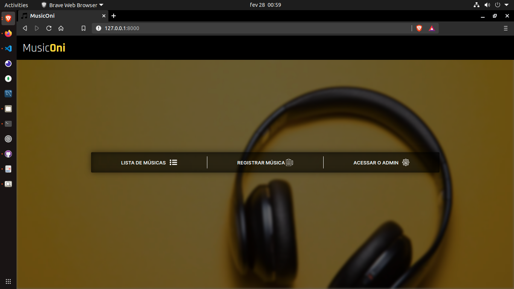
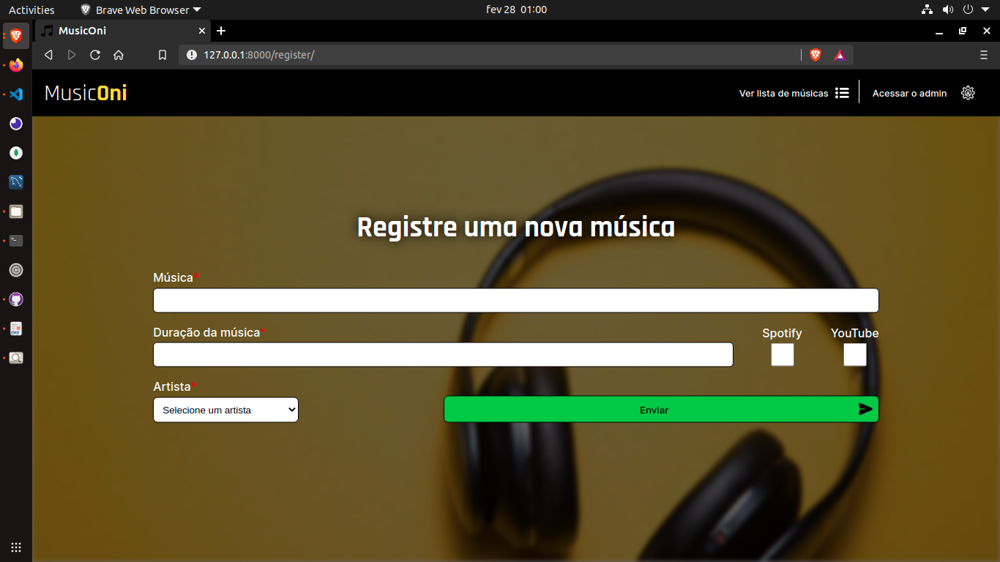
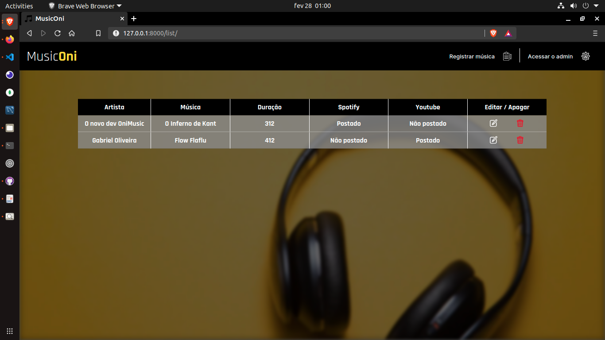
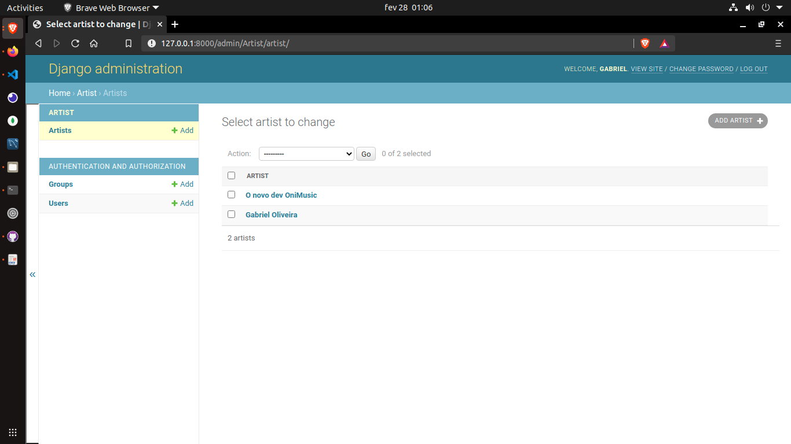

[![Stargazers][stars-shield]][stars-url]
[![LinkedIn][linkedin-shield]][linkedin-url]

<br /> 
<div style="display: flex; flex-direction: column;">
  <p align="center">
    <a href="https://github.com/g4brieloliveira/desafio-onimusic">
      <h1 align="center">Music<strong>Oni</strong></h1>
    </a>
    <div style=" display: flex">
      
      
      
      
    </div>
    <p align="center">
      <br />
      <a href="https://github.com/g4brieloliveira/desafio-onimusic"><strong>Ver a documentação</strong></a>
    </p>
  </p>

  <details open="open">
    <summary><h2 style="display: inline-block">Navegue pelo README</h2></summary>
    <ol>
      <li>
        <a href="#about-the-project">Sobre o projeto</a>
        <ul>
          <li><a href="#built-with">Tecnologias</a></li>
        </ul>
      </li>
      <li>
        <a href="#getting-started">Para testar</a>
        <ul>
          <li><a href="#prerequisites">Pré requisitos</a></li>
          <li><a href="#installation">Instalação</a></li>
        </ul>
      </li>
    </ol>
  </details>


  ## Sobre o projeto:
  O projeto foi feito visando o Desafio Onidevs, da empresa [Onimusic](https://onimusic.com.br/) para a aplicação de uma [vaga](https://coodesh.com/vagas/estagio-em-desenvolvimento-web-usando-pythondjango-175648?utm_campaign=website&utm_source=mail&utm_medium=sendgrid) de Estágio em Desenvolvimento Web usando Python/Django.

  </br>
  </br>

  ### Tecnologias utilizadas:
  * [Django](https://www.djangoproject.com/)
  * [Django-admin](https://docs.djangoproject.com/en/3.1/ref/contrib/admin/)
  * [HTML5](https://developer.mozilla.org/pt-BR/docs/Web/Guide/HTML/HTML5)
  * [CSS3](https://developer.mozilla.org/pt-BR/docs/Web/CSS)
  * [SQLite](https://www.sqlite.org/index.html)

  </br>
  </br>
</div>

## Para testar

Para obter uma cópia local, siga os seguintes passos:

### Pré requisitos

* pip 
  ```sh
    python -m pip install -U pip
  ```
* virtualenv
  ```sh
    python -m pip install -U virtualenv
  ```
### Instalação
1. Clone o repositório
  ```sh
    git clone https://github.com/g4brieloliveira/desafio-onimusic.git
  ```
2. Crie uma Virtualenv na pasta raiz do projeto
  ```sh
    virtualenv venv
  ```
3. Ative sua virtualenv
  ```sh
    source venv/bin/activate (Linux ou macOS)
    venv/Scripts/activate (Windows)
  ```
4. Instale o Django na venv
  ```sh
    pip install django
  ```
5. Rode o servidor
  ```sh
    python manage.py runserver
  ```

[stars-shield]: https://img.shields.io/github/stars/github_username/repo.svg?style=for-the-badge
[stars-url]: https://github.com/g4brieloliveira/desafio-onimusic/stargazers
[linkedin-shield]: https://img.shields.io/badge/-LinkedIn-black.svg?style=for-the-badge&logo=linkedin&colorB=555
[linkedin-url]: https://www.linkedin.com/in/g4brieloliveira/
